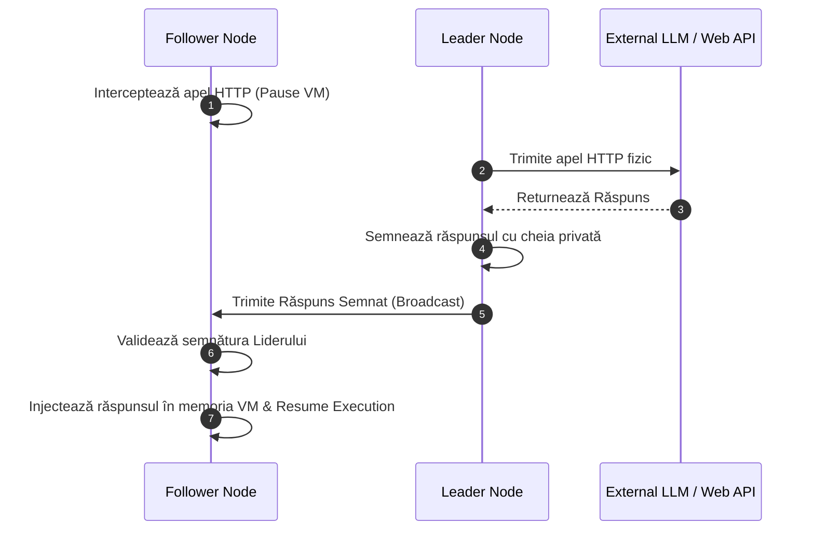

# Consens de Execuție în Clustere Replicate (Bypass Side-Effects & Duplicate Writes)

Acest document descrie protocolul de consens prin care clusterele active-active din Boxty (de exemplu, 3 noduri care rulează în paralel aceeași funcție în sandbox) interacționează cu serviciile externe (APIs, LLMs, baze de date) fără a dubla acțiunile și fără a induce drift de stare.

---

## 1. Problema Replicării Active

Într-un cluster descentralizat de sandbox-uri cu factor de replicare $N = 3$:
* Fiecare nod primește același trigger de execuție.
* Dacă codul utilizatorului apelează `database.insert()` sau trimite un apel de plată `stripe.charge()`, acțiunea s-ar executa de 3 ori, ceea ce duce la tranzacții duplicat și date corupte.
* Dacă codul face un apel LLM (`openai.com`), fiecare mașină ar putea primi un răspuns ușor diferit din cauza temperaturii modelului sau a latenței de rețea, rupând determinismul stării.

```
       [ Client / Trigger ]
                │
         ┌──────┼──────┐
         ▼      ▼      ▼
      Node 1  Node 2  Node 3    <-- 3 sandbox-uri identice
         │      │      │
         └──────┼──────┘
                │
                ▼
  [ Database / Stripe / LLM ]   <-- EVITĂ: 3 tranzacții sau 3 apeluri diferite!
```

---

## 2. Soluția Boxty: Interceptare și Consens de Rețea

Pentru a asigura **execuția exact-o-singură-dată (Exactly-Once Execution)**, Boxty folosește două fluxuri distincte, în funcție de tipul operațiunii:

### A. Citiri și Interogări Nondeterministe (Outbound Reads - ex: LLM, Web Scraping)
Pentru citiri de date din exterior unde răspunsurile pot varia, folosim **Consens prin Interceptare de Lider**:

1. **Leader (Node 1)** execută apelul HTTP real către internet.
2. **Followers (Node 2 și 3)** au syscall-ul de rețea interceptat la nivel de Hypervisor/Sandbox (vezi `intercepted_http_request` în [`src/sandbox/mod.rs`](file:///Users/adriantucicovenco/Proiecte/boxty/agentnet/cli/sdk/src/sandbox/mod.rs#L30-L41)). Execuția lor este pusă în stare de așteptare (Paused).
3. Liderul primește răspunsul HTTP, îl semnează criptografic cu cheia sa privată și îl distribuie în micro-cluster.
4. Urmăritorii (Followers) recepționează răspunsul semnat, validează semnătura Liderului, sar peste execuția fizică a apelului de rețea și injectează direct răspunsul primit în memoria virtuală a sandbox-ului, reluând execuția.
5. **Rezultat**: Răspunsul este 100% identic pe toate cele 3 mașini, iar apelul extern a fost taxat o singură dată.



---

### B. Scrieri și Acțiuni cu Efecte Secundare (Outbound Writes - ex: Plăți, Baze de Date)
Pentru scrierile în baze de date sau tranzacții financiare externe, aplicăm două strategii:

#### Metoda 1: Semnături de Prag (Threshold Cryptography / MPC)
Pentru rețele externe compatibile (cum ar fi blockchain-uri sau API-uri ce suportă semnături multi-sig/MPC):
* Cele 3 noduri rulează protocolul de semnătură parțială implementat în [`wallet/mod.rs:mpc_sign_request`](file:///Users/adriantucicovenco/Proiecte/boxty/agentnet/cli/sdk/src/wallet/mod.rs#L218-L255).
* Fiecare nod generează o semnătură parțială folosind share-ul său Shamir.
* Semnăturile parțiale sunt combinate într-o singură semnătură validă.
* Destinatarul extern (baza de date sau smart contractul) primește o **singură** tranzacție semnată. Dacă un nod încearcă să trimită din nou tranzacția, ea este respinsă instant ca atac de tip Replay (datorită mecanismului de nonces/timestamp).

#### Metoda 2: Execuție Unică la Lider + Atestare Hardware (TEE)
Pentru API-uri web clasice (ex. Stripe):
1. Doar nodul desemnat ca Lider execută fizic scrierea.
2. Înainte de a procesa scrierea, serverul bazei de date (sau gateway-ul Boxty) solicită Liderului o atestare de consens (care dovedește că Node 1 este într-adevăr liderul curent validat de ceilalți 2 prin algoritmul Raft).
3. Ceilalți urmăritori doar verifică starea finală rezultată în urma scrierii liderului și o sincronizează local prin CRDT (Automerge).

---

## 3. Exemplu Practic în SDK

În fișierul [**`web_server_model.py`**](file:///Users/adriantucicovenco/Proiecte/boxty/examples/web_server_model.py), apelul:
```python
response = bx.http.post("https://api.openai.com/v1/chat/completions", json=...)
```
este interceptat automat de runtime-ul Boxty. Chiar dacă codul este rulat simultan în 3 mașini virtuale, apelul de rețea este transformat transparent într-un consens de grup, garantând că rețeaua LLM primește un singur request.
