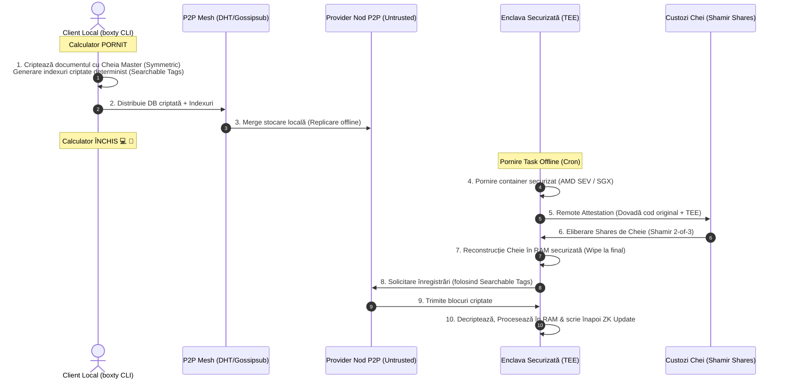

# Arhitectura Bazei de Date NoSQL Zero-Knowledge în Boxty

Acest document descrie arhitectura tehnică detaliată pentru un sistem de stocare NoSQL descentralizat, securizat prin criptare client-side, interogabil (Searchable Encryption) și replicabil în mod offline, cu execuție securizată în enclave hardware (TEEs).

---

## 1. Arhitectura Generală (Zero-Knowledge Syncing)

Pentru ca utilizatorul să își poată închide calculatorul, dar baza de date să rămână activă, replicabilă și securizată în rețeaua P2P Boxty, aplicăm principiul de **Zero-Knowledge / Cryptographic Encapsulation**.



---

## 2. Componentele Sistemului

### A. Client-Side Searchable Encryption (SSE)
Pentru a asigura confidențialitatea, datele sunt criptate înainte de a părăsi calculatorul clientului. Totuși, pentru ca nodurile provider să poată căuta/filtra înregistrări în timp ce clientul este offline, folosim **Symmetric Searchable Encryption**:
* **Hash-uri Keyed (simulare HMAC)**: Câmpurile indexate (ex. `status = "active"`) sunt transformate în hash-uri deterministe folosind cheia privată a clientului.
  $$FieldHash = KeyedHash(MasterKey, "status")$$
  $$ValueHash = KeyedHash(MasterKey, "active")$$
* Nodul P2P stochează doar aceste hash-uri în indexul public și poate realiza interogări prin potrivire exactă, fără a cunoaște semnificația cuvintelor și fără a putea decripta documentul asociat.

### B. Distribuția Cheilor prin Shamir's Secret Sharing (2-of-3)
Când clientul este offline, dar un cron-task sau un agent AI rulat în cloud (sandbox) trebuie să scrie/citească din baza de date:
1. Cheia de decriptare este fragmentată în 3 părți (shares) folosind schema Shamir implementată în [`src/wallet/mod.rs`](file:///Users/adriantucicovenco/Proiecte/boxty/agentnet/cli/sdk/src/wallet/mod.rs#L126-L160).
2. Părțile sunt trimise la 3 custozi de cheie diferiți în rețea.
3. Enclava hardware (TEE) solicită aceste părți și le combină în memorie doar după validarea atestării.

### C. Trusted Execution Environments (TEEs) & Remote Attestation
Fără un mediu securizat pe serverul providerului, deținătorul fizic (root) ar putea citi cheia din memoria RAM. Enclavele hardware (cum ar fi AMD SEV sau Intel SGX) criptează memoria RAM la nivel de procesor:
* **Remote Attestation**: Enclava generează un raport semnat de procesor care certifică faptul că rulează codul original, nealterat.
* **Reconstrucția Cheii**: Custozii eliberează share-urile de cheie doar către enclave atestate, direct în memoria RAM criptată a enclavei.

---

## 3. Implementarea în Cod

Am creat o simulare completă și funcțională a acestui flux în [**`encrypted_db.rs`**](file:///Users/adriantucicovenco/Proiecte/boxty/agentnet/cli/sdk/src/sync/encrypted_db.rs):

1. **`EncryptedDatabase`**: Gestionează criptarea datelor la client și crearea tag-urilor de căutare.
2. **`UntrustedStorageProvider`**: Gestionează stocarea de către nodurile terțe și procesarea interogărilor pe date criptate (Zero-Knowledge Search).
3. **`TeeEnclaveSimulator`**: Simulează atestarea hardware și restaurarea cheii din share-uri de către custozi pentru execuția cron/task-urilor offline.

### Rularea Simulării
Acest mecanism este integrat în comanda de rulare a funcțiilor CLI. La execuția:
```bash
cargo run -- function --wasm test_agent.wasm
```
Sistemul rulează pas cu pas scenariul:
1. Criptează înregistrarea `"Adrian Tucicovenco: Principal Systems Architect"` cu tag-urile indexate `role=Architect` și `status=active`.
2. Trimite blocul criptat către nodul untrusted.
3. Clientul se deconectează (simulat).
4. Nodul untrusted caută înregistrările potrivind doar hash-urile tag-urilor.
5. Se lansează o enclavă securizată TEE care își generează raportul de atestare, își extrage cheia master din custozi și decriptează datele exclusiv în interiorul RAM-ului securizat.

---

## 4. Volume Persistente Criptate & Startup Ultrarapid (OverlayFS + mmap)

Pentru scenarii de Machine Learning unde un sandbox efemer trebuie să încarce greutăți de zeci de gigabiți (ex: Llama-3 8B - 15 GB) instantaneu, copierea fișierelor dintr-un volum persistent pe cel al containerului ar dura minute. Arhitectura Boxty rezolvă asta prin două mecanisme de nivel scăzut:

### A. Criptare Block-Level (LUKS/dm-crypt)
Volumul persistent este stocat ca un fișier sparse disk criptat prin standardul industrial LUKS (AES-256-XTS). 
1. Cheia de decriptare este furnizată exclusiv de portofelul utilizatorului (sau în TEE prin atestare).
2. Sistemul de operare montează imaginea ca un dispozitiv bloc virtual deblocat sub `/dev/mapper/pv_<id>_decrypted`.

### B. OverlayFS pentru Partajare Instant (Zero-Copy)
În loc să copiem fișierele:
1. Montăm volumul persistent deblocat ca **`lowerdir` (Read-Only)**.
2. Directoriul local al sandbox-ului efemer este setat ca **`upperdir` (Read-Write)**.
3. OverlayFS unifică cele două directore într-un singur punct de montare (**`Merged View`**).
4. Orice citire a greutăților se face direct din volumul persistent securizat. Orice scriere/modificare făcută de scriptul de antrenare este izolată în stratul efemer (`upperdir`), păstrând volumul persistent intact și imutabil.

### C. Încărcare rapidă în RAM prin Memory Mapping (`mmap`)
Pentru o eficiență maximă:
* Sandbox-ul nu citește fișierul de model în RAM prin `read()`. În schimb, folosește syscall-ul `mmap` pentru a mapa adresele fișierului direct în spațiul de adrese virtuale.
* Greutățile sunt încărcate în memoria fizică la nivel de pagină RAM, exclusiv în momentul primei accesări (on-demand page faults).

---

> [!TIP]
> Structura de indexare poate fi extinsă pentru a susține arbori de căutare mai complecși (Merkle DAGs), permițând actualizări incrementale ale bazei de date fără a re-descărca sau re-cripta întregul set de date la volume mari.
